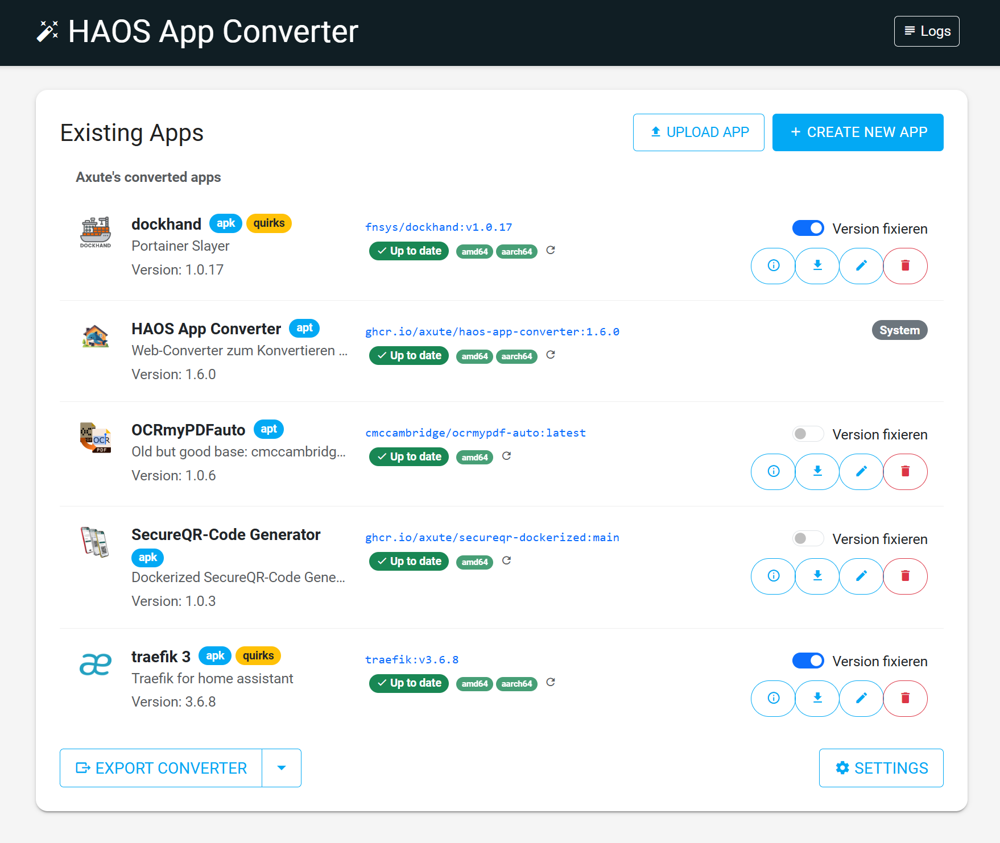

# HAOS App Converter


[](docs/assets/Screenshot-1.png)

This tool is a web-based converter that transforms any Docker image into a Home Assistant app.

## Features

### 🚀 Key Features
- **Smart Container Conversion**: Automatically detects entrypoints, architectures, and package managers using `crane`.
- **Flexible Configuration**: Support for environment variables (static, editable, and user-defined).
- **Home Assistant Native**: Full integration with Ingress, Side Panels, Backups, and Storage Mappings.
- **Health Monitoring**: Integrated support for Docker timeouts and Home Assistant Watchdog (HTTP/HTTPS/TCP).
- **Advanced Quirks Mode**: Optional wrapper for custom startup scripts and enhanced shell support.
- **Automated Updates**: One-click updates for base images with version detection.

Detailed information about all supported Home Assistant configuration options and features can be found in our **[Supported Features Documentation](docs/SupportedFeatures.md)**.
Detailed overview of the **[Frontend Features](docs/frontend-features.md)**.

## Prerequisites

- PHP 8.3 or higher (or Docker)
- Composer (if not run via Docker)

## Installation & Usage

### Option 1: With Docker (Recommended)
You can use the pre-built image from GHCR:
```bash
docker run -d -p 8985:80 -v $(pwd)/data:/var/www/html/data ghcr.io/axute/haos-app-converter:latest
```

### Option 2: Home Assistant App
You can also use this converter as a Home Assistant app by adding the following repository to your Home Assistant instance:
[https://github.com/axute/hassio-addons-converted](https://github.com/axute/hassio-addons-converted)

### Option 3: Local with PHP
1. Install dependencies:
   ```bash
   composer install
   php install.php
   ```
2. Start the PHP web server:
   ```bash
   php -S localhost:8000 -t public
   ```
3. Open the converter in your browser: [http://localhost:8000](http://localhost:8000)

## Project Structure

Generated apps are created in the `/data/{app-slug}` directory. Each directory contains all necessary files like `config.yaml`, `Dockerfile`, and `README.md`.

For a full list of generated files and their purpose, please refer to the **[Supported Features Documentation](docs/SupportedFeatures.md)**.

## Environment Variables

- `CONVERTER_DATA_DIR`: (Optional) Path to the data directory. Default is `./data`. When the converter runs as an HA app, this is automatically set to `/addons`.

---

## 💎 Credits & Acknowledgments

This project wouldn't be possible without these amazing tools and libraries:

- **[bashio](https://github.com/hassio-addons/bashio)**: A powerful library for Home Assistant apps that provides essential helper functions.
- **[gomplate](https://github.com/hairyhenderson/gomplate)**: A flexible template renderer used for robust environment variable processing.
- **[crane](https://github.com/google/go-containerregistry)**: Used for deep inspection and analysis of container images.
- **[EasyMDE](https://github.com/Ionaru/easy-markdown-editor)**: Provides the beautiful Markdown editor for app documentation.
- **[Slim Framework](https://www.slimframework.com/)**: The lightweight PHP framework powering the backend.
- **[Twig](https://twig.symfony.com/)**: The modern template engine for PHP.
